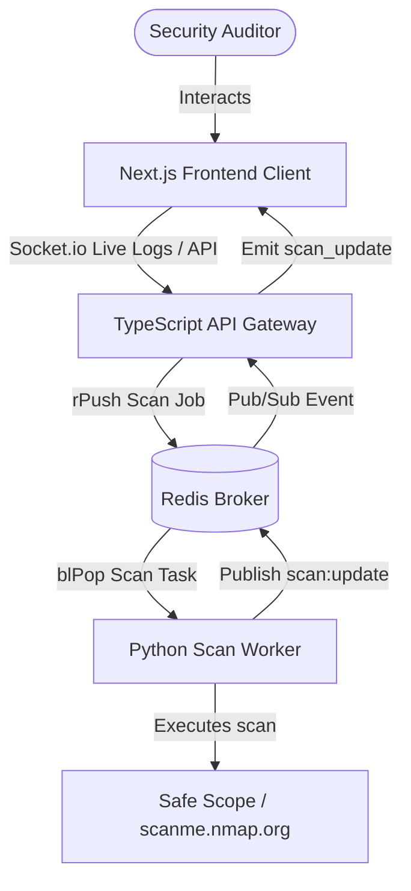

# 🛡️ ShadowAudit | Real-Time Security Auditing Framework

> **Automated, decoupled vulnerability scanning orchestration managed by TypeScript API Gateway, Redis Broker, and Python workers.**

ShadowAudit is an enterprise-grade security auditing and target exploration tool. Designed to isolate scanning workloads from client telemetry web interfaces, it utilizes an asynchronous event-driven pattern: 
1. **Next.js Frontend** client triggers and observes real-time scanner logs.
2. **TypeScript API Gateway** enqueues scans and broadcasts logging sequences via Socket.io.
3. **Redis Broker** manages the FIFO queue (`shadowaudit:queue`) and results channel (`shadowaudit:results`).
4. **Python Audit Worker** pulls tasks, executes Nmap sweeps (or falls back to raw TCP socket audits), and streams live console logs.

---

## 🏗️ System Design & Architectural Topology

The system is decoupled into three primary nodes:



---

## ✨ Features

- **Real-Time Log Streaming**: Live console feeds from the scanning worker are broadcasted straight to the frontend dashboard using WebSockets.
- **Resilient Hybrid Scanner**: Runs comprehensive TCP Connect sweeps using the python-nmap interface; falls back to an ultra-fast raw socket engine if system binaries are missing.
- **Defense-in-Depth Whitelist**: Protects against unauthorized network scanning through strict target validation (only `localhost`, `127.0.0.1`, and `scanme.nmap.org` are authorized).
- **Dockerized Microservices**: Orchestrate the gateway, broker, worker, and frontend with a single command.

---

## 📁 Repository Structure

```
├── api-gateway/            # Express + TypeScript Server (Socket.io)
├── audit-worker/           # Python Scan Engine & FastAPI monitor
├── frontend/               # Next.js 14 Dashboard Application
├── docker-compose.yml      # Orchestrates all microservices
└── README.md               # System Documentation
```

---

## 🚀 Setup & Installation

### Multi-Container Deployment (Recommended)
Launch the entire system locally inside a Docker bridge network:

```bash
# Clone the repository
git clone https://github.com/Thepimen/ShadowAudit.git
cd ShadowAudit

# Spin up all containers in the background
docker-compose up -d --build

# Verify running services
docker-compose ps
```

Services will mount at:
- **Next.js Frontend Dashboard**: [http://localhost:3000](http://localhost:3000)
- **TypeScript API Gateway**: [http://localhost:4000](http://localhost:4000)
- **FastAPI Worker Monitoring**: [http://localhost:8000](http://localhost:8000)

---

### Local Standalone Setup
If running the services directly on your local system:

#### 1. Ingest Broker (Redis)
Verify that a Redis instance is running locally on port `6379`.

#### 2. Start the API Gateway
```bash
cd api-gateway
npm install
npm run dev
```

#### 3. Start the Scan Worker
```bash
cd ../audit-worker
python -m venv .venv
source .venv/bin/activate  # On Windows: .venv\Scripts\activate
pip install -r requirements.txt
python main.py
```

#### 4. Launch the Frontend
```bash
cd ../frontend
npm install
npm run dev
```
Open [http://localhost:3000](http://localhost:3000) in your web browser.

---

## 📡 API Reference Gateway

Authentication payloads must target the Ingestion endpoint on port `4000`:

| Method | Endpoint | Description | Payload Example |
| :--- | :--- | :--- | :--- |
| `POST` | `/api/audit/scan` | Validates target, generates UUID, and enqueues job. | `{"target": "scanme.nmap.org"}` |
| `GET` | `/health` | Check gateway status logs. | *(None)* |

### Ingestion Response (`POST /api/audit/scan`)
```json
{
  "status": "Accepted",
  "auditId": "8f93da1a-4c28-4e89-8d01-e2a4417a8cf2",
  "message": "Security audit scan accepted and enqueued.",
  "target": "scanme.nmap.org"
}
```
